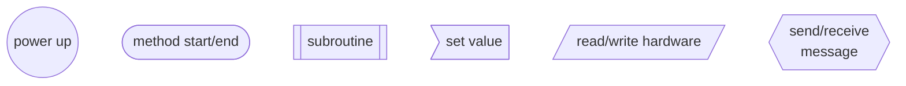

# Controller flowchart
## Legend


## Init
```mermaid
graph TD;
    START((power up)) --> INIT>active = false\nstatus = off];
    INIT --> INSTR_ON[/instrument light on/];
    INSTR_ON --> METER_MAX[["meter test(max)"]];
    METER_MAX --> LED[["status led test"]] --> METER_MIN[["meter test(min)"]];
    METER_MIN --> INSTR_OFF[/instrument light off/];
    INSTR_OFF --> LOAD_SETTINGS[[load settings]];
    LOAD_SETTINGS --> INITEND([main loop]);

    LED_TEST([status led test]) --> LED_RED;
    LED_RED[/status led RED/] --> WAIT_RED[wait 500ms] --> LED_ORANGE;
    LED_ORANGE[/status led ORANGE/] --> WAIT_ORANGE[wait 500ms] --> LED_GREEN;
    LED_GREEN[/status led GREEN/] --> WAIT_GREEN[wait 500ms] --> LED_OFF[/status led off/] --> LED_TEST_END([return]);

    METER_TEST(["meter test(val)"]) --> METER_TEST_LOOP[/loop meters\];
    METER_TEST_LOOP --> METER_SET[set meter to val] --> METER_TEST_LOOP_END[\loop meters end/];
    METER_TEST_LOOP_END --> METER_TEST_END([return]);

    LOADSETTINGS([load settings]) --> ENDLOAD;
    
    ENDLOAD([return]);
  ```

## Main
```mermaid
graph TD;

    LOOPSTART[/main loop\] --> GET_DATA[[get CAN data]] --> GET_SWITCHES[[get switches]] --> GET_POTS[[get potentiometer]] --> GET_STATI[[set status]] --> SWITCH_STATUS;
    SWITCH_STATUS{action by status};
    SWITCH_STATUS --> |off| ACTION_OFF;
    SWITCH_STATUS --> |standby| ACTION_STANDBY;
    SWITCH_STATUS --> |on| ACTION_ON;
    SWITCH_STATUS --> |ready| ACTION_READY;
    SWITCH_STATUS --> |moving| ACTION_MOVING;
    ACTION_OFF[[action off]] --> SET_SPEEDO;
    ACTION_STANDBY[[action standby]] --> SET_SPEEDO;
    ACTION_ON[[action on]] --> SET_METERS;
    ACTION_READY[[action ready]] --> SET_METERS;
    ACTION_MOVING[[action moving]] --> SET_METERS;
    SET_METERS[/set meters\nvoltage\ncurrent/] --> SEND_DATA;
    SEND_DATA[[send controller data]] --> SET_SPEEDO;
    SET_SPEEDO[/set speedo/] --> ENDLOOP;
    ENDLOOP[\end main loop/];

    GET_CAN([get CAN data]) --> MESSAGE_AVAILABLE{message available};
    MESSAGE_AVAILABLE --> |N| PARSE_MESSAGES;
    MESSAGE_AVAILABLE --> |Y| SWITCH_MESSAGE{message type};
    SWITCH_MESSAGE --> |drive| GET_MOTOR;
    SWITCH_MESSAGE --> |voltage| GET_VOLTAGE;
    SWITCH_MESSAGE --> |current| GET_CURRENT;
    SWITCH_MESSAGE --> |speed| GET_SPEED;
    
    GET_MOTOR>"message_buffer[uuid] = message"] --> PARSE_MESSAGES;
    GET_VOLTAGE>"voltage = message.data"] --> PARSE_MESSAGES;
    GET_CURRENT>"current = message.data"] --> PARSE_MESSAGES;
    GET_SPEED>"speed = message.data"] --> PARSE_MESSAGES;

    PARSE_MESSAGES[parse messages] --> END_CAN;
    END_CAN([return]);

    GETSWITCHES([get switches]) --> FETCH_DIGITAL>"flags.switches.mains = mains.get()\nflags.switches.dir = dir.get()\nflags.switches.light = light.get()\nflags.switches.light_1 = light_1.get()\nflags.switches.horn = horn.get()"] --> ENDSWITCHES;
    ENDSWITCHES([return]);

    GETPOTS([get pots]) --> FETCH_ANALOG>"driveval = analog.drive\nanalogval = analog.break\npowerval = analog.power"] --> ENDPOTS;
    ENDPOTS([return]);

    GET_STATUS([set status]) ==> CHECK_ACTIVE;
    CHECK_ACTIVE[["check for activatable"]] ==> IS_ACTIVE{can be activated?};
    IS_ACTIVE --> |N| SET_ACT_OFF>active = false] --> STATUS_OFF>status = off] --> LED_STATUS;
    IS_ACTIVE ==> |Y| IS_MAINS{can.status.mains = on?};
    IS_MAINS --> |N| STATUS_STANDBY>status = standby] --> LED_STATUS;
    IS_MAINS ==> |Y| CHECK_SETUP{"horn == true &&\nactive == false"};
    CHECK_SETUP ==> |N| SET_ACT_ON;
    CHECK_SETUP --> |Y| START_SETUP[[loco setup]];
    START_SETUP --> SET_ACT_ON;
    SET_ACT_ON>active = true] ==> IS_DRIVE{drive on?};
    IS_DRIVE --> |N| STATUS_NO_DIR>status = no direction] --> LED_STATUS;
    IS_DRIVE ==> |Y| CHECK_MOVING{is moving?};
    CHECK_MOVING --> |N| STATUS_READY>status = ready] --> LED_STATUS;
    CHECK_MOVING ==> |Y| STATUS_MOVING>status = moving] --> LED_STATUS;
    LED_STATUS[[set status led]] --> END_STATUS([return]);

    SENDDATA([send controller data]) --> DATA_TIMEOUT{data timeout?};
    DATA_TIMEOUT --> |N| HB_TIMEOUT;
    DATA_TIMEOUT --> |Y| DATA;
    DATA{{"send data:\nstatus\nswitches\npotentiometer"}} --> HB_TIMEOUT{"controller\nheartbeat\ntimeout?"};
    HB_TIMEOUT --> |Y| SEND_HB{{send heartbeat}} --> ENDSENDDATA;
    HB_TIMEOUT -->|N| ENDSENDDATA;
    ENDSENDDATA([return]);
```
## Loco setup
Select locomotive in multi traktion and set direction of locomotive.
The setup is entered by setting 
```mermaid
graph TD;

    LOCOSETUP([loco setup]) --> LED_SETUP[/status led setup/];
    LED_SETUP --> SETUP_LOOP;
    SETUP_LOOP[/loop\] --> GET_HORN_BUTTON;
    GET_HORN_BUTTON[[get horn button]] --> GET_MAINS{mains on?};
    GET_MAINS --> |N| LED_OFF;
    GET_MAINS --> |Y| SELECT_LOCO{horn button};
    SELECT_LOCO{{clear setup mode on all locos\nset loco in setup mode}} --> CHECK_HORN;
    CHECK_HORN --> |N| END_LOOP;
    CHECK_HORN --> |short| GET_DIR{dir switch};
    CHECK_HORN --> |long| END_SETUP;
    GET_DIR --> |off| STEP;
    GET_DIR --> |forward| SET_FORWARD>toggle dir] --> SEND_DIR;
    GET_DIR --> |backward| SET_BACKWARD>toggle dir] --> SEND_DIR;
    SEND_DIR[[send direction change]] --> END_LOOP
    STEP[select next loco] --> END_LOOP;
    END_LOOP[\end loop/] --> LED_OFF;
    END_SETUP[save settings] --> END_LOOP;
    LED_OFF --> ENDLOCOSETUP;
    ENDLOCOSETUP([return]);
