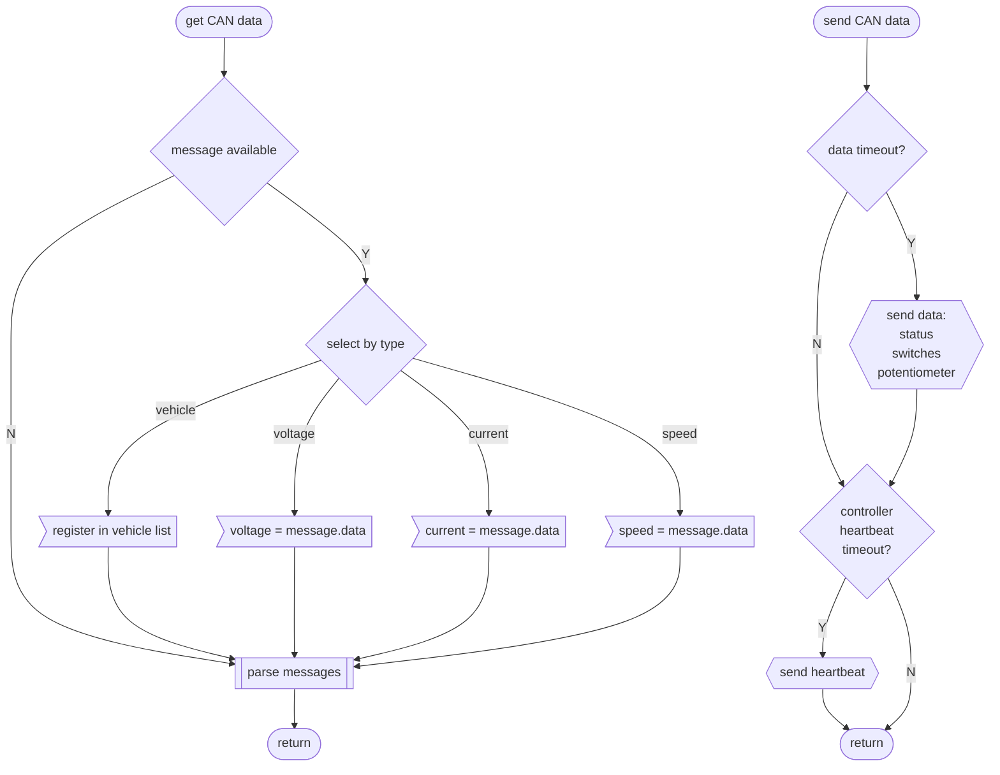

# Controller floatchart

## Function
In a train setup many controllers and many locomotives can be connected but only one controller can be active. If more than one locomotive is connected (multi traktion) the telemetry data are displayed from only one locomotive. The headlights are only activated from the selected loco, all others keep dark. The active locomotive can be selected in the loco setup mode.

## Legend


## Init
```mermaid
graph TD;
    %% controller init

    subgraph global;
        globalvars>bool active\nint status\n] --- globalmeter;
        globalmeter>INTELLILED status_led\nMETER volt\nMETER ampere\nMETER speed] --- globalbutton;
        globalbutton>ANALOGSWITCH mains\nANALOGSWITCH dir\nANALOGSWITCH light];
    end

    %% power up
    %% node definitions
    START((power up));
    INIT_VAR>active = false\nstatus = off];
    INIT_LED[/"status_led.begin()"/];
    INSTR_ON[/instrument light on/];
    METER_MAX[["meter test(max)"]];
    LED_TEST[["status led test"]];
    METER_MIN[["meter test(min)"]];
    INSTR_OFF[/instrument light off/];
    LOAD_SETTINGS[[load settings]];
    INITEND([main loop]);

    %% flow
    START --> INIT_VAR --> INIT_LED --> INSTR_ON;
    INSTR_ON --> METER_MAX --> LED_TEST --> METER_MIN --> INSTR_OFF;
    INSTR_OFF --> LOAD_SETTINGS;
    LOAD_SETTINGS --> INITEND;

    %% led test
    %% node definitions
    LEDTEST([status led test]);
    LED_RED[/status_led RED/];
    LED_ORANGE[/status_led ORANGE/];
    LED_GREEN[/status_led GREEN/];
    LED_OFF[/status_led off/];
    WAIT_RED[wait 500ms];
    WAIT_ORANGE[wait 500ms];
    WAIT_GREEN[wait 500ms];

    %% flow
    LEDTEST --> LED_RED --> WAIT_RED --> LED_ORANGE --> WAIT_ORANGE --> LED_GREEN --> WAIT_GREEN --> LED_OFF;

    %% meter test
    %% node definitions
    METER_TEST(["meter test(val)"]);
    METER_TEST_VOLT[/"volt(val)"/];
    METER_TEST_AMP[/"ampere(val)"/]
    METER_TEST_SPEED[/"speed(val)"/];
    METER_TEST_END([return]);

    %% flow
    METER_TEST --> METER_TEST_VOLT --> METER_TEST_AMP --> METER_TEST_SPEED --> METER_TEST_END;

    %% load settings
    %% node definitions
    LOADSETTINGS([load settings]);
    ENDLOAD([return]);
    
    %% flow
    LOADSETTINGS --> ENDLOAD;
  ```

## Main
### Main loop
```mermaid
graph TD;
    %% controller main loop

    subgraph global
        globalvars>METER speed];
    end

    %% node definitions
    LOOPSTART[/main loop\];

    subgraph get data
        GET_DATA[[get CAN data]];
        GET_SWITCHES[[get switches]];
        GET_POTS[[get potentiometer]];
        GET_STATI[[set status]];
    end

    SWITCH_STATUS{action by status};
    ACTION_OFF[[action off]];
    ACTION_STANDBY[[action standby]];

    subgraph controller active
        ACTION_ON[[action on]];
        ACTION_READY[[action ready]];
        ACTION_MOVING[[action moving]];
        SET_METERS[/"volt.set(message.volt)\nampere.set(message.ampere)"/];
        SEND_DATA{{"send controller data:{\nstatus,\ndrive_val,\nbreak_val,\npower_val}"}};
    end

    SET_SPEEDO[/"speed.set(message.speed)"/];
    ENDLOOP[\end main loop/];

    %% flow
    LOOPSTART --> GET_DATA --> GET_SWITCHES --> GET_POTS --> GET_STATI --> SWITCH_STATUS;
    SWITCH_STATUS --> |off| ACTION_OFF;
    SWITCH_STATUS --> |standby| ACTION_STANDBY;
    SWITCH_STATUS --> |on| ACTION_ON;
    SWITCH_STATUS --> |ready| ACTION_READY;
    SWITCH_STATUS --> |moving| ACTION_MOVING;

    ACTION_OFF --> SET_SPEEDO;
    ACTION_STANDBY --> SET_SPEEDO;
    ACTION_ON --> SET_METERS;
    ACTION_READY --> SET_METERS;
    ACTION_MOVING --> SET_METERS;

    SET_METERS --> SEND_DATA --> SET_SPEEDO --> ENDLOOP;
```

### CAN communication


### Hardware access


### Status parser


## Loco setup
Select locomotive in multi traktion and set direction of locomotive. To enter the loco setup mode the controller must be activateable, so no other controller can be switched on.

Enter setup mode:
1.  mains switch off
2.  push and hold the horn button
3.  mains switch on

The status led blinks orange fastly.

To exit the setup mode, the mains switch must be switched off. All settings are saved.

### Loco pairing
To select a loco as paired in a multi traktion setup, the direction switch must be in off position. The selected loco is blinking with all headlights. Short push the horn button to select the next loco.

### Loco direction setup
To synchronize the position of the direction switch on the controller and the actual driving direction of the loco, this setup is used. It can be done for more locos in a multi traktion setup by stepping from loco to loco using the horn button.

To select the forward direction of a loco, the direction switch has to be brought in the position, where the forward lights of the selected loco are blinking.

Short push the horn button to select the next loco.

