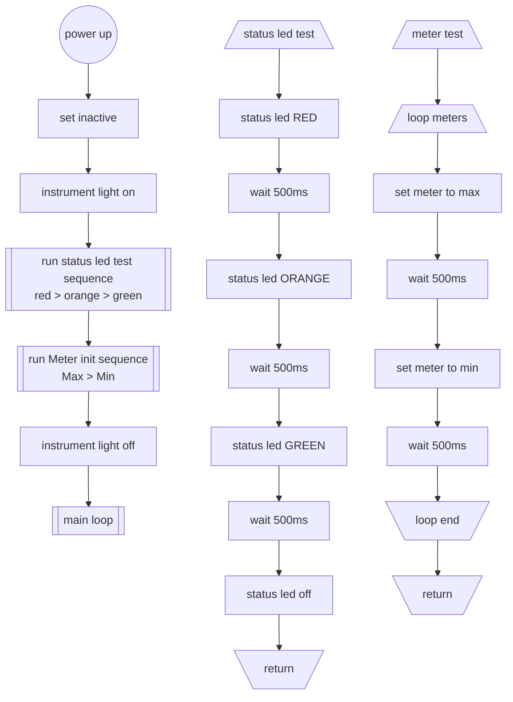
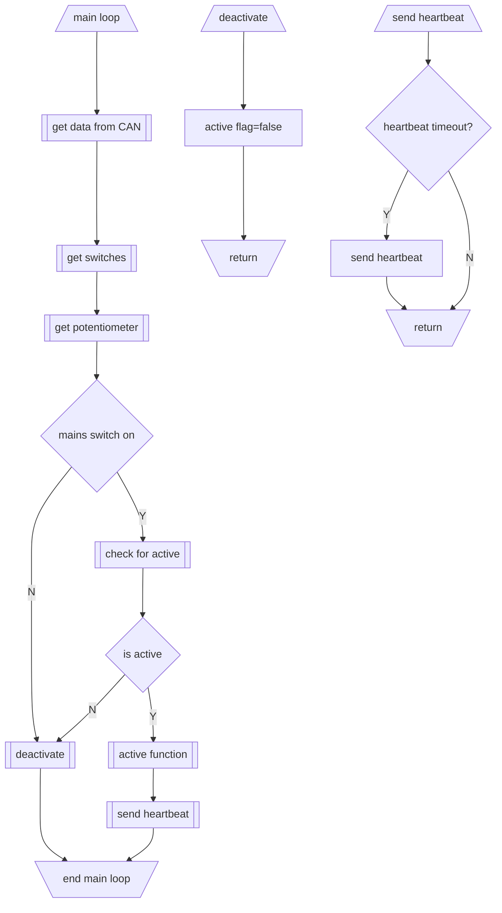

# Controller flowchart
## Init

```mermaid
graph TD;
  Start((power up)) --> Init[set inactive];
  Init --> Instr[instrument light on];
  Instr --> LED[["run status led test sequence\nred > orange > green"]];
  LED --> METER[["run Meter init sequence\nMax > Min"]];
  METER --> dark[instrument light off];
  dark --> INITEND[[main loop]];

LED_TEST[/status led test\] --> LED_RED;
LED_RED[status led RED] --> WAIT_RED[wait 500ms] --> LED_ORANGE;
LED_ORANGE[status led ORANGE] --> WAIT_ORANGE[wait 500ms] --> LED_GREEN;
LED_GREEN[status led GREEN] --> WAIT_GREEN[wait 500ms] --> LED_OFF[status led off] --> LED_TEST_END[\return/];

METER_TEST[/meter test\] --> METER_TEST_LOOP[/loop meters\];
METER_TEST_LOOP --> METER_MAX[set meter to max] --> METER_WAIT_1;
METER_WAIT_1[wait 500ms] --> METER_MIN[set meter to min] --> METER_WAIT_2[wait 500ms];
METER_WAIT_2 --> METER_TEST_LOOP_END[\loop end/];
METER_TEST_LOOP_END --> METER_TEST_END[\return/];
```

## Main

```mermaid
graph TD;

LOOPSTART[/main loop\] --> GET_DATA[[get data from CAN]] --> SWITCHES[[get switches]] --> GET_POTS[[get potentiometer]] --> CHECK_MAINS{mains on} -->|Y| CHECK_ACTIVE;
CHECK_MAINS{mains switch on} -->|N| OFF;
CHECK_ACTIVE[["check for active"]] --> ISACTIVE{is active};
ISACTIVE -->|Y| ACTIVE[[active function]];
ISACTIVE --> |N| OFF;
OFF[[deactivate]] --> ENDLOOP;
ACTIVE --> SEND_HEARTBEAT[[send heartbeat]] --> ENDLOOP;
ENDLOOP[\end main loop/];

DEACTIVATE[/deactivate\] --> FLAG_DEACT[active flag=false] --> ENDDEACT;
ENDDEACT[\return/];

HEARTBEAT[/send heartbeat\] --> HB_TIMEOUT{heartbeat timeout?} -->|Y| SEND_HB[send heartbeat] --> ENDHEARTBEAT;
HB_TIMEOUT{heartbeat timeout?} -->|N| ENDHEARTBEAT;
ENDHEARTBEAT[\return/];
```
