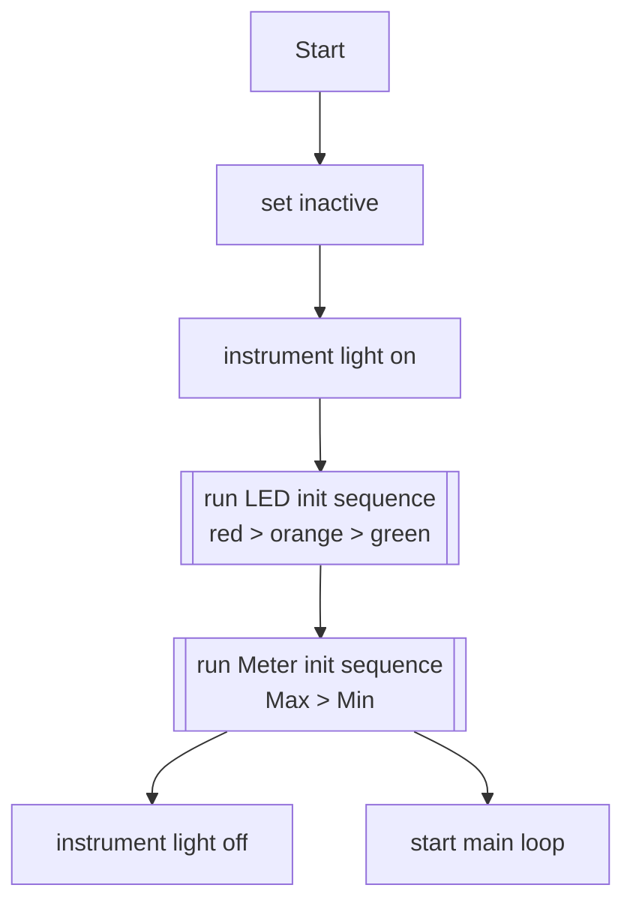

# Controller function

```mermaid
graph TD;
  Start --> Init[set inactive];
  Init --> Instr[instrument light on];
  Instr --> LED[["run LED init sequence\nred > orange > green"]];
  LED --> Meter[["run Meter init sequence\nMax > Min"]];
  Meter --> Dark[instrument light off];
  Meter --> End[start main loop];

```
