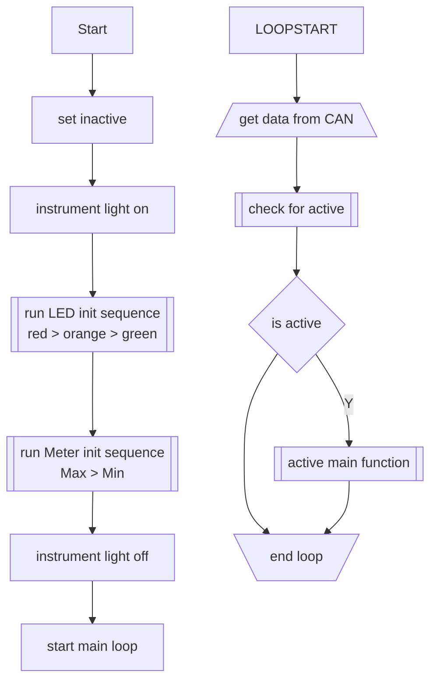

# Controller function

```mermaid
graph TD;
  Start --> Init[set inactive];
  Init --> Instr[instrument light on];
  Instr --> LED[["run LED init sequence\nred > orange > green"]];
  LED --> METER[["run Meter init sequence\nMax > Min"]];
  METER --> dark[instrument light off];
  dark --> INITEND[start main loop];

LOOPSTART --> GET_DATA[/get data from CAN\];
GET_DATA --> CHECK_ACTIVE[["check for active"]];
CHECK_ACTIVE --> ISACTIVE{is active};
ISACTIVE -->|Y| ACTIVE[[active main function]];
ISACTIVE --> ENDLOOP;
ACTIVE --> ENDLOOP;

ENDLOOP[\end loop/];

```
