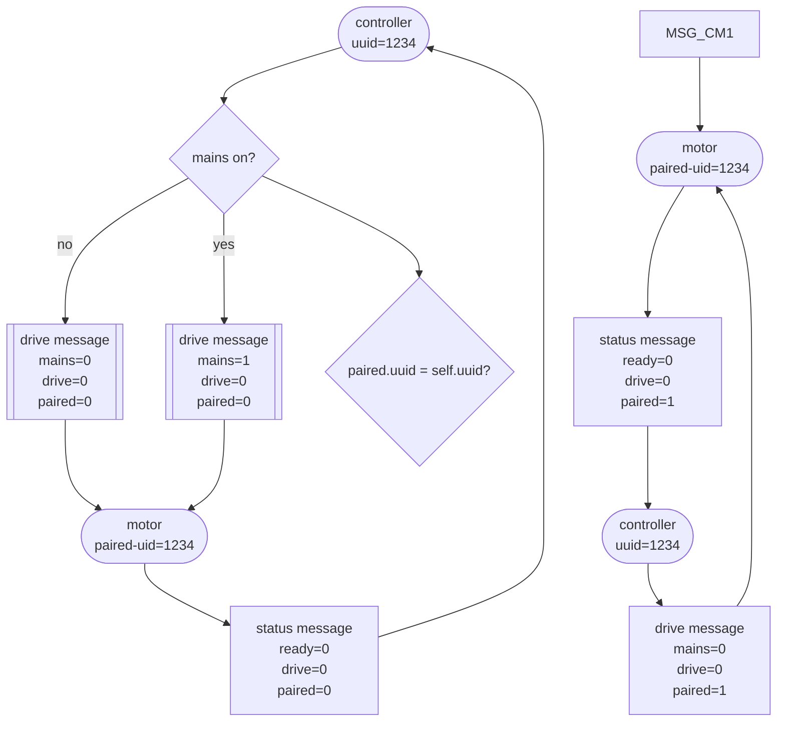
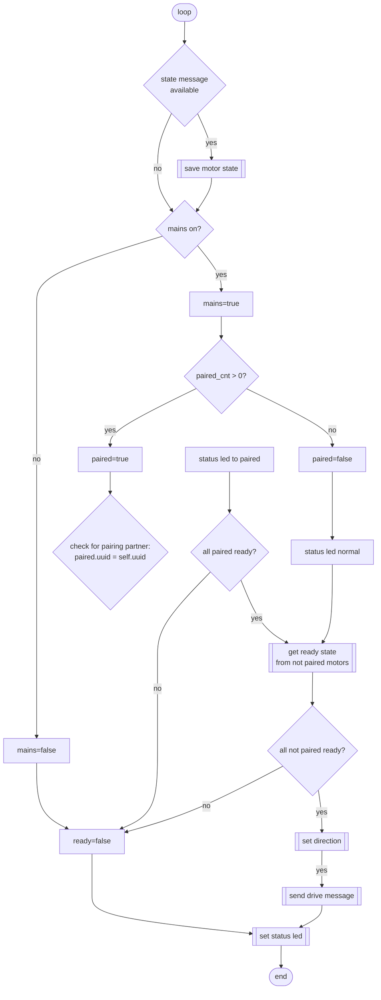
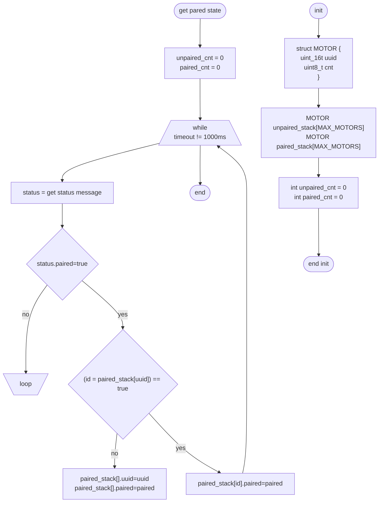

# LOCO-Controller
The LOCO-Controller software is used in the Universal and Universal-WiFi modules to create a driving console. It can directly be plugged into the Universal Control Adapter that provides JST-connectors for input and ouput devices.

## Hardware version
The hardware specifications are described in the README files of the Universal and Universal-WiFi modules.

## IO-connectors
| Bus 1         |
|:--------------|
| 1 VCC         |
| 2 LED red     |
| 3 LED green   |
| 4 Instr.light |
| 5 Horn        |
| 6 Volt Batt   |
| 7 Volt Motor  |
| 8 Ampere      |
| 9 GND         |

| Bus 2a       |
|:-------------|
| 1 +12V       |
| 1 +12V       |
| 2 Light SW   |
| 3 Mains SW   |
| 4 Dir. SW    |
| 5 Light SW 1 |

| Bus 2b      |
|:------------|
| 1 Break pot |
| 2 Drive pot |
| 3 Horn 1    |
| 4 GND       |

## IO

### Analog switches
The input pins for light, mains and direction use the analog switch library. The output values are set by learned voltages, that represent the different switch positions. On the hardware side a switch witch resistors can be used.

### Measurement Outputs
The outputs to display voltage or current values can be set to analog or servo signals (analog output is not yet implemented).

## Functions

### Locomotive Setup
The locomotive setup process is initiated by setting the main switch to off, pushing and holding the horn button and switching on the mains again. The status led will alternatingly blink orange and green and the headlights of the locomotive will start to blink on both sides. If there are more locomotives connected to the bus, a short push on the horn will switch to the next locomotive and this locos lights will start to blink.

The setup mode is ended by switching the main switch to off.

#### Pairing
A controller can be used for all driving modules (like motor or servo modules) but also paired with a particular module. In this case the uuid of the paired module is saved in the oposite unit (uuid of the motor in the controller and vice versa).

After entering the setup mode the direction switch has to be in the neutral position. If the locomotive already is paired, the status led will blink green only. The pairing is finished by holding the horn button for more than three seconds. The status led and the locomotive headlights will rapidly blink green three times. If the locomotive already is paired, the pairing is deleted and the status led will blink alteratingly green and orange again.

#### Direction setup
Depending on the side, the train is connected to the locomotive, the direction settings on the controller can vary from the actual driving direction. The can be set using the locomotive setup process.

After entering the setup mode and selecting the locomotive by pressing the horn button all headlights of the locomotive will blink. By switching the direction button to forward or reverse, the corresponding lights on the locomotive will blink, the other side will be off. By setting the direction switch to the position, where the forward lights are blinking and holding the horn button for three seconds, the forward direction is set.

This operation is necessary in case of multiple traction.

### Multi Traction
The controller module takes the following actions:

1. Main on
2. Registers all motor modules using the module heartbeat
3. Registers all controllers by the module heartbeat

## How-To???

C1 = Controller-1
M1 = Motor-1

C1 (active)
C2 (active paired)
C3
C4 (paired)

M1
M2 (paired->Controller-2) - one lococ
M3 (paired->Controller-2) - one lococ
M4 (paired->Controller-4)
M5 (paired->Controller-5 - not present)

C1 -> M1, M4, M5
C2 -> M2, M3

deactivate C2
C1 -> takes M2, M3

### Activate controller

Multiple motors can be paired to a controller. A Controller has no pairing information stored. In case of pairing the controller sets the paired flag in the drive message. The paired flag of the motor is set, if a pairing uuid is stored. 

**Controller finds paired motors**
* paired flag in drive message is true
* show paired status led???

**Controller finds no paired motor** 
* paired flag in drive message is true


* controller is not paired -> get all not paired motor modules -> all stati must be ready to drive
* Controller is paired -> get paired motor module -> only paired status must be ready to drive

* Motor module checks, if the paired controller is active -> sets paired flag in motor status
not paired: listen to not paired controller or 

**byte 0: drive status**

|Byte |Bit 7  |Bit 6  |Bit 5  |Bit 4  |Bit 3  |Bit 2  |Bit 1  |Bit 0  |
|:---:|-------|-------|-------|-------|-------|-------|-------|-------|
|0    |error  |ready  |stop   |paired |reverse|dir    |drive  |mains  |
|1    |uuid-15|uuid-14|uuid-13|uuid-12|       |       |drive-9|drive-8|
|2    |drive-7|drive-6|drive-5|drive-4|drive-3|drive-2|drive-1|drive-0|
|3    |uuid-11|uuid-10|uuid-9 |uuid-8 |       |       |power-9|power-8|
|4    |power-7|power-6|power-5|power-4|power-3|power-2|power-1|power-0|
|5    |       |       |       |       |       |       |break-9|break-8|
|6    |break-7|break-6|break-5|break-4|break-3|break-2|break-1|break-0|
|6    |uuid-7 |uuid-6 |uuid-5 |uuid-4 |uuid-3 |uuid-2 |uuid-1 |uuid-0 |


`´`mermaid
flowchart TD
    C1[controller-1\nUUID=1] --> C1_pair_1["paired\n2"]
    C1_pair_1 --> C1_pair_2["paired\n*"]
    C1_pair_2 --> C1_pair_3["paired\n*"]
    C1_pair_3 --> C1_pair_4["paired\n*"]

    C2[controller-2\nUUID=5] --> C2_pair_1["paired\n*"]
    C2_pair_1 --> C2_pair_2["paired\n*"]
    C2_pair_2 --> C2_pair_3["paired\n*"]
    C2_pair_3 --> C2_pair_4["paired\n*"]

    C3[controller-3\nUUID=8] --> C3_pair_1["paired\n*"]
    C3_pair_1 --> C3_pair_2["paired\n*"]
    C3_pair_2 --> C3_pair_3["paired\n*"]
    C3_pair_3 --> C3_pair_4["paired\n*"]

    M1[motor-1\nUUID=2] --> M1_pair_1["paired\n1"]
    M1_pair_1 --> M1_pair_2["paired\n4"]
    M1_pair_2 --> M1_pair_3["paired\n*"]
    M1_pair_3 --> M1_pair_4["paired\n*"]

    M2[motor-2\nUUID=3] --> M2_pair_1["paired\n*"]
    M2_pair_1 --> M2_pair_2["paired\n*"]
    M2_pair_2 --> M2_pair_3["paired\n*"]
    M2_pair_3 --> M2_pair_4["paired\n*"]

    M3[motor-3\nUUID=6] --> M3_pair_1["paired\n*"]
    M3_pair_1 --> M3_pair_2["paired\n*"]
    M3_pair_2 --> M3_pair_3["paired\n*"]
    M3_pair_3 --> M3_pair_4["paired\n*"]

    M4[motor-4\nUUID=7] --> M4_pair_1["paired\n*"]
    M4_pair_1 --> M4_pair_2["paired\n*"]
    M4_pair_2 --> M4_pair_3["paired\n*"]
    M4_pair_3 --> M4_pair_4["paired\n*"]

    SW1[switch-1\nUUID=4] --> SW1_pair_1["paired\n2"]
    SW1_pair_1 --> SW1_pair_2["paired\n*"]
    SW1_pair_2 --> SW1_pair_3["paired\n*"]
    SW1_pair_3 --> SW1_pair_4["paired\n*"]

    SW2[switch-2\nUUID=9] --> SW2_pair_1["paired\n*"]
    SW2_pair_1 --> SW2_pair_2["paired\n*"]
    SW2_pair_2 --> SW2_pair_3["paired\n*"]
    SW2_pair_3 --> SW2_pair_4["paired\n*"]

    C1_pair_1 --> M1_pair_1
    M1_pair_2 --> SW1_pair_1
```


    



