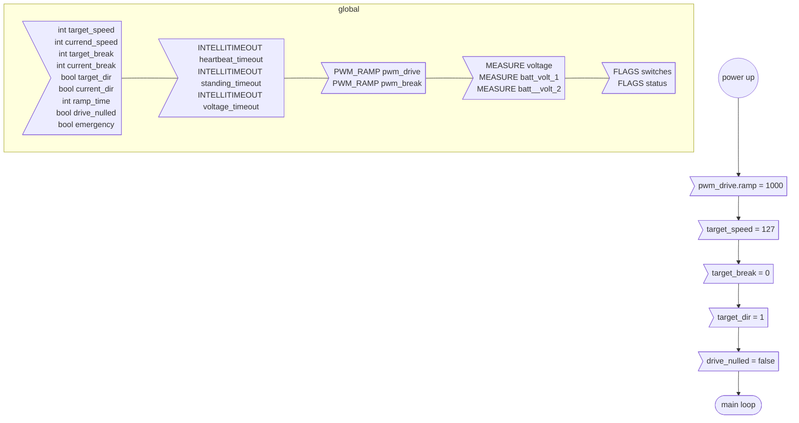
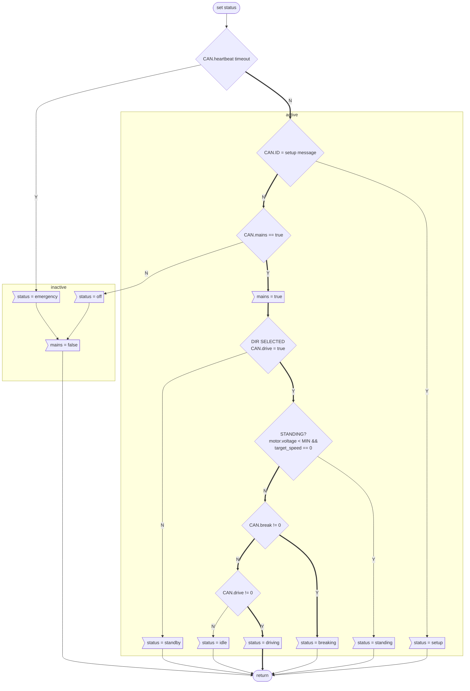
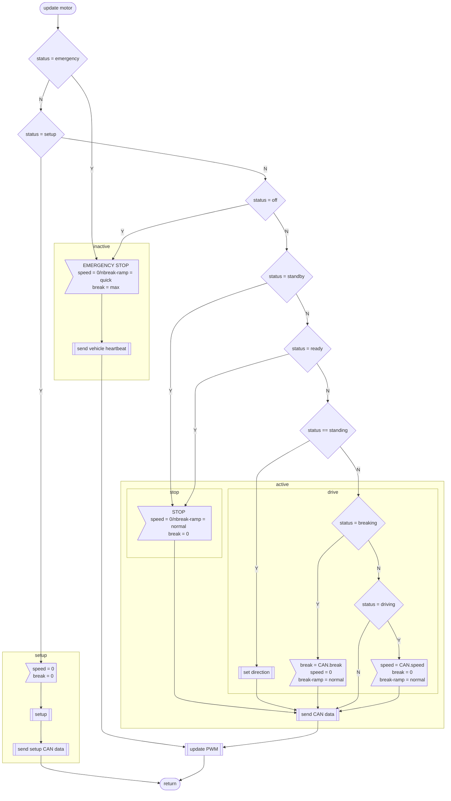
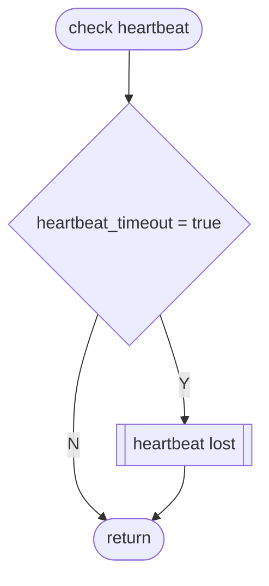

# Motor floatchart

## Function
The motor module can be connected to a controller or another motor module. In the first case a controller heardbeat must be present, else an emergency break is triggert. The module can also be operated in slave mode getting all commands from another motor module.

## Legend


## Init


## Status parser

The motor module can be in 8 different stati, that depend on the locomotive movement and the CAN drive message.

* emenrgency: controller heartbeat has timed out

All following stati depend on a valid controller heartbeat:

* off: mains is off
* standby: mains = on but no direction selected
* standing: mains = on, direction selected (drive = true) but loco is not moving
* idle: mains = on, direction selected and moving without drive or break
* driving: mains = on, direction selected, target_speed set
* breaking: mains = on, direction selected, target_break set

* setup: the controller is in loco setup mode




## update motor


## Main
### Main loop
graph TD;
    %% motor main loop

    %% node definitions
    LOOPSTART[/main loop\];
    ERROR_OFF>status.ERROR_FLAG = false];
    GETCAN{{get CAN message}};
    PARSE_MESSAGE[[parse drive message]];
    START_SETUP[[start loco setup]];

    subgraph standby
        SETUP{"loco setup message &&\nstanding = true &&\nmains = off"};
        DRIVE_NULLED{target_speed = 0?};
        SET_NULLED>drive_nulled = true];
    end

    subgraph heartbeat failure
        CHECKHEARTBEAT{check heartbeat};
        EMERGENCY_STOP[[emergency stop]];
        DRIVE_NULLED_FALSE>dirve_nulled = false];
    end

    subgraph drive
        CHECK_MAINS{message.mains = on};
        SET[[set parameters]];
        STOP[[stop loco]];
    end

    UPDATE[[update motor]];
    SEND{{send parameters:\ncurrent_speed\ncurrent_dir}};
    ENDLOOP[\end main loop/];

    %% flow main loop
    LOOPSTART --> GETCAN --> PARSE_MESSAGE --> SETUP;

    SETUP --> |N| START_SETUP --> UPDATE;
    SETUP --> |Y| DRIVE_NULLED;

    DRIVE_NULLED --> |N| CHECKHEARTBEAT;
    DRIVE_NULLED --> |Y| SET_NULLED --> CHECKHEARTBEAT;

    CHECKHEARTBEAT --> |OK| CHECK_MAINS;
    CHECKHEARTBEAT --> |TIMEOUT| DRIVE_NULLED_FALSE --> EMERGENCY_STOP --> UPDATE --> SEND --> ENDLOOP;

    CHECK_MAINS --> |Y| SET --> UPDATE;
    CHECK_MAINS --> |N| STOP --> UPDATE;


    %% node definitions
    SETPARAMS([set parameters]);
    SET_SPEED>target_speed = message.target_speed];
    SET_BREAK>target_break = message.target_break];
    SET_DIR>target_dir = message.target_dir];
    ENDSET([return]);

    %% flow set parameters
    SETPARAMS --> SET_SPEED --> SET_BREAK --> SET_DIR --> ENDSET;

    STARTSTOP([stop loco]);
    SETSTOP>target_speed = 0];
    ENDSTOP([return]);

    EMERGENCYSTOP([stop loco]);
    SETEMERGSTOP>target_speed = 0\nbreak_speed = max\ntarget_break = max];
    ENDEMERGSTOP([return]);

    EMERGENCYSTOP --> SETEMERGSTOP --> ENDEMERGSTOP;

    UPDATESTART([update motor]);
    IS_STANDING{loco is standing?};
    CHANGE_DIR{target_dir != current_dir};
    SETDIR>current_dir = target_dir];
    WRITEDIR[/direction = current_dir/];
    UPDATEEND([return]);

    UPDATESTART --> IS_STANDING;
    IS_STANDING --> |N| UPDATEEND;
    IS_STANDING --> |Y| CHANGE_DIR;
    CHANGE_DIR --> |N| UPDATEEND;
    CHANGE_DIR --> |Y| SETDIR --> WRITEDIR --> UPDATEEND;
    
    PARSE([parse drive message]);
    PARSE_MAINS{message.mains = 1};
    ENDPARSE([return]);

    PARSE --> PARSE_MAINS;
    PARSE_MAINS --> |N| ENDPARSE;
    PARSE_MAINS --> |Y| ENDPARSE;
```

### Heartbeat

