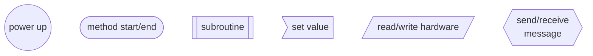
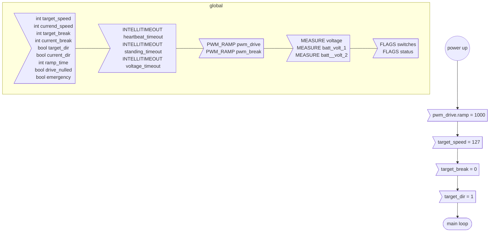
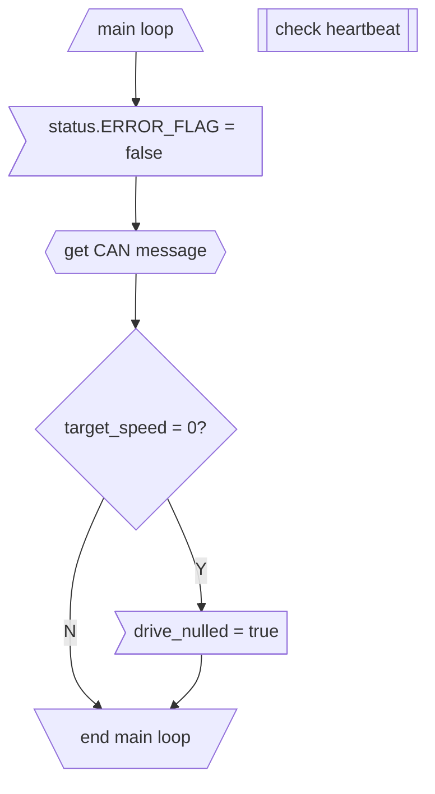

# Motor floatchart

## Legend


## Init


## Main
### Main loop


### Heartbeat
```mermaid
graph TD;
    %% check heartbeat

    %% node definitions
    CHECKSTART([check heartbeat]);
    TIMEOUT{heartbeat_timeout = true}
    LOST[[heartbeat lost]];
    RETURN([return]);

    %% flow
    CHECKSTART --> TIMEOUT;
    TIMEOUT --> |N| RETURN;
    TIMEOUT --> |Y| LOST --> RETURN;
