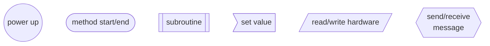
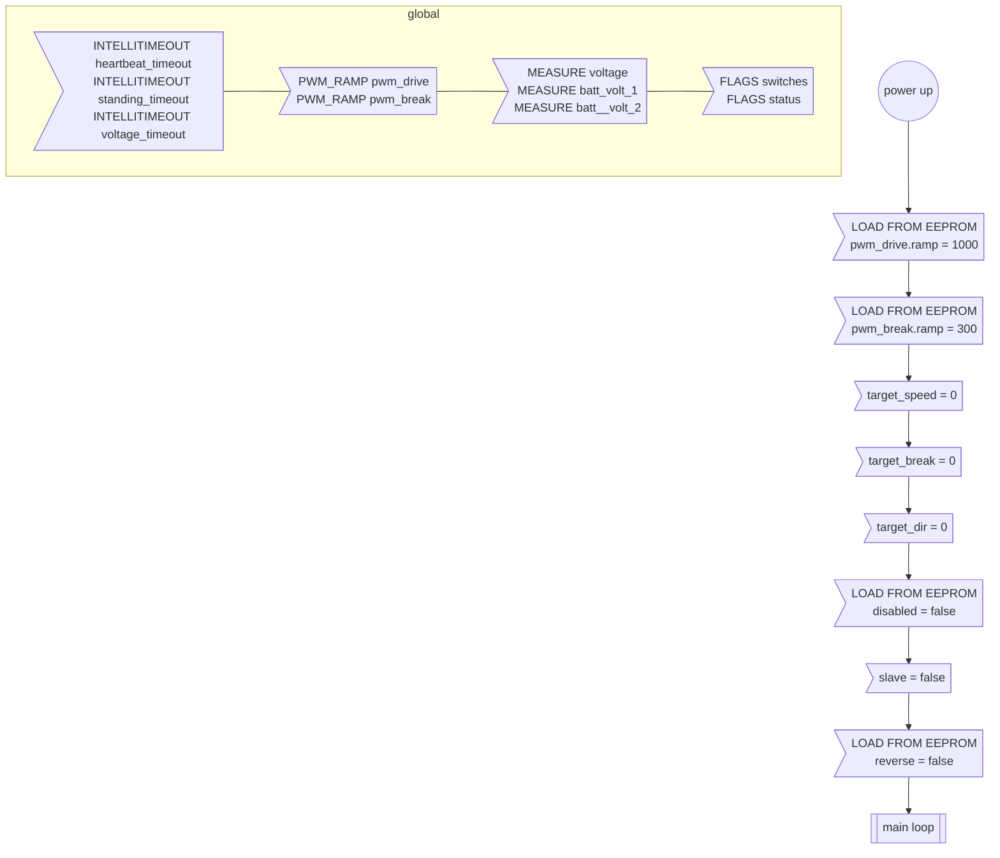
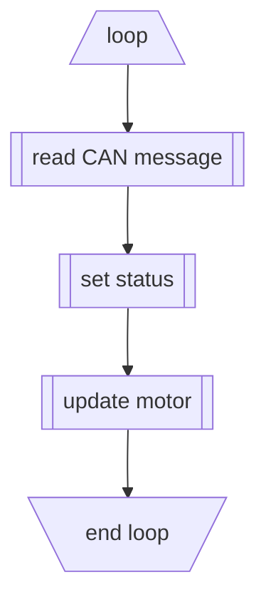
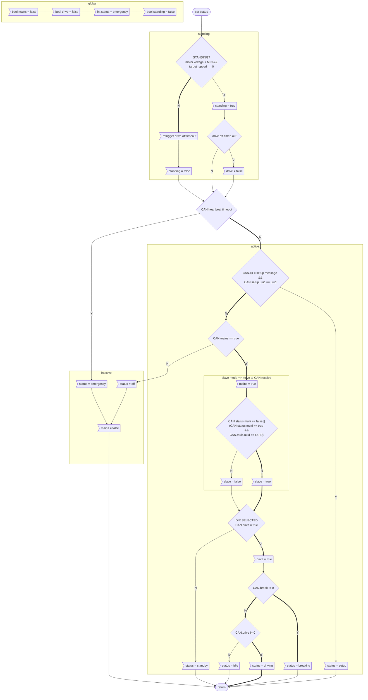
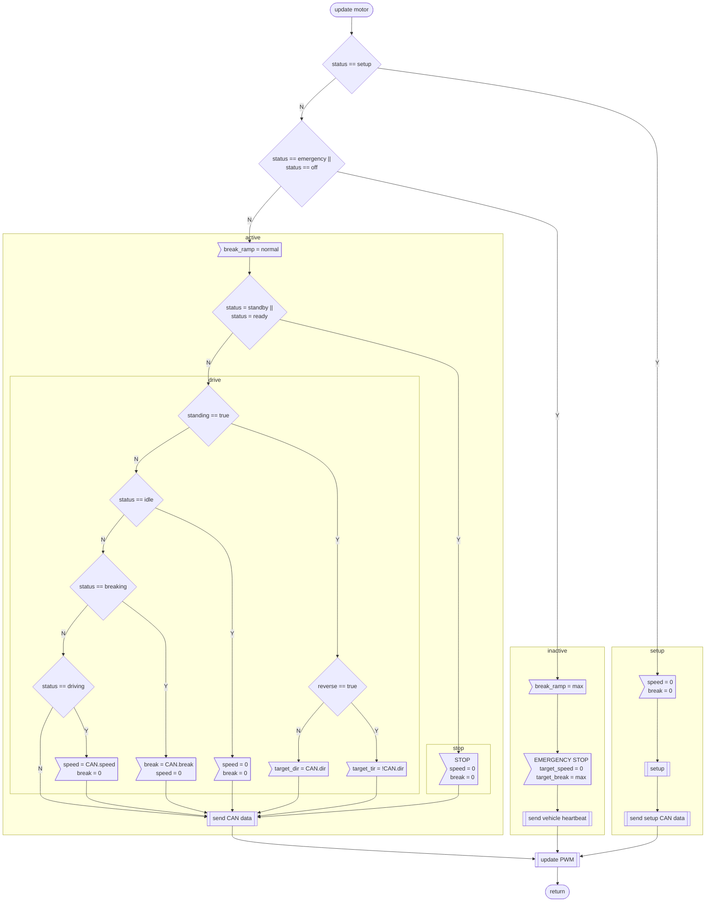
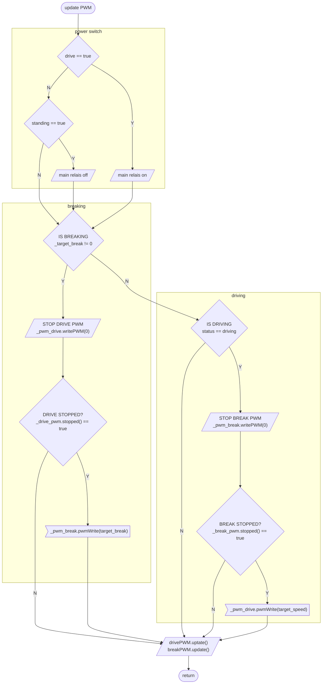
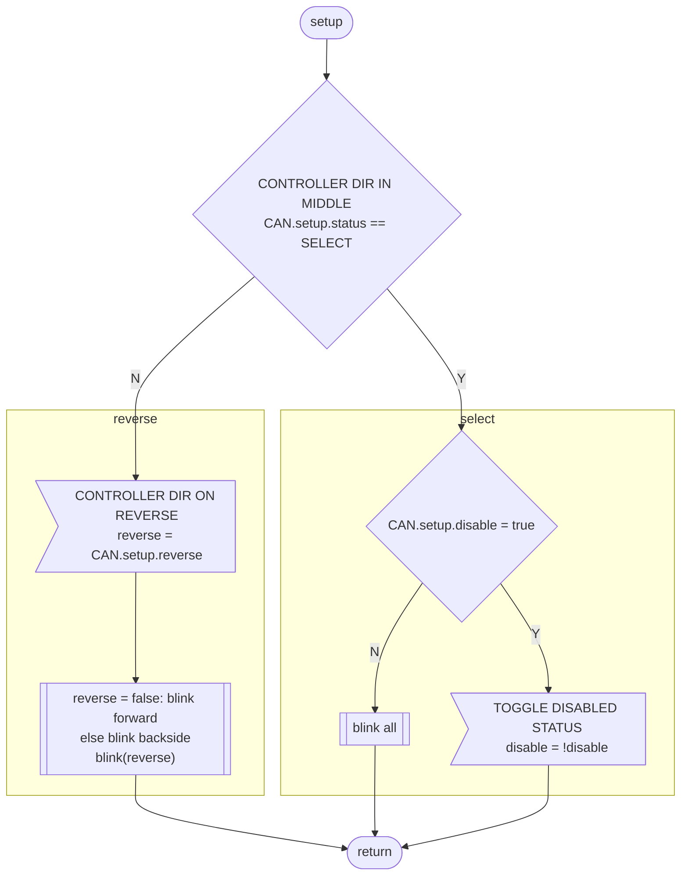

# Motor flowchart

## Function
The motor module can be connected to a controller or another motor module. In the first case a controller heardbeat must be present, else an emergency break is triggert. The module can also be operated in slave mode getting all commands from another motor module.

## Legend

## Init

## Main loop

## Status parser

The motor module can be in different stati, that depend on the locomotive movement and the CAN drive message.

The standing status (if the vehicle is not moving) is stored in a bool variable. The status is independent of the motor status.
The drive status (main power relais) is stored in a bool variable.

* emenrgency: controller heartbeat has timed out

All following stati depend on a valid controller heartbeat:

* off: mains is off
* standby: mains = on but no direction selected
* idle: mains = on, direction selected and moving without drive or break
* driving: mains = on, direction selected, target_speed set
* breaking: mains = on, direction selected, target_break set

* setup: the controller is in loco setup mode

If the controller sends a multi traktion uuid (bit 7 of byte 2 = true), and the uuid is not the own,
light or pantograph functions are disabled.

## update motor

## Update PWM

# Setup

